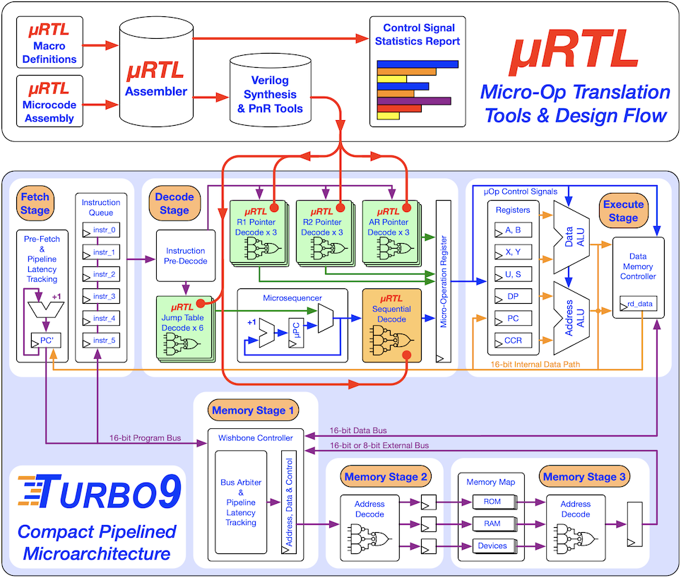

# Turbo9 - A Compact & Efficient Pipelined 6809 Microprocessor IP

### Soft release v0.9 - This repository is still under construction!

----------------------------------------

## Overview
* [What is the Turbo9?](#what-is-the-turbo9)   
* [What are the target applications?](#what-are-the-target-applications)
* [Why use the 6809 instruction set? Why not RISC?](#why-use-the-6809-instruction-set-why-not-risc)
* [What is uRTL micro-op translation?](#what-is-urtl-micro-op-translation)

## The Basics
* [Key Features](#key-features) 
* [Presentations](#presentations)
* [Publications](#publications)
* [Directory Structure](#directory-structure)
* [Third-Party Tools](#third-party-tools)
* [Current Status](#current-status)
* [Team Members](#team-members)
* [Faculty](#faculty)
* [Contact](#contact)

----------------------------------------

## What is the Turbo9?
The Turbo9 is a pipelined microprocessor IP written in Verilog that executes a superset of the Motorola 6809 instruction set. It is a new modern microarchitecture with 16-bit internal datapaths that balances high performance vs small area / low power. The Turbo9R with a 16-bit memory interface achieves 0.69 DMIPS/MHz which is 3.8 times faster than Motorola's original 8-bit MC6809 implementation. It is an active graduate research project at the [Department of Electrical & Computer Engineering](http://www.ece.ufl.edu) at the [University of Florida](http://www.ufl.edu)

   

----------------------------------------

## What are the target applications?
The target applications are SoC sub-blocks or small mixed-signal ASICs that require a compact and efficient microprocessor for programmable high-level control. There are many 32 or 64-bit  RISC-V or ARM cores that try to fill this niche, but prove to be inefficient solutions given many of these applications only require 16-bit precision.

----------------------------------------

## Why use the 6809 instruction set? Why not RISC?
Current industry trends are to adapt 32-bit RISC IP for microcontroller use, however their large 32x32 register files and loosely encoded instructions limit their absolute minimum footprint. So with the goal of a creating a performance _and_ _compact_ microprocessor IP, we need an 16-bit instruction set architecture (ISA). Also, we want an architecture that is capable of running C code effectively. Given these requirements, the Motorola 6809 ISA stands out with its minimal number of registers (shown below), orthogonal instruction set, and powerful indexed and indirect addressing modes that map well to C concepts, such as arrays and pointers. 

----------------------------------------

## What is uRTL micro-op translation?
The 6809's elegant accumulator-style instruction set is simpler than many RISC ISAs. However, it is retroactively classified as a CISC architecture because it violates the RISC "load-store" principle, using memory as an operand in many instructions. Consequently, load and store operations with the 6809's advanced address modes are often required as steps prior to an ALU operation. This is not an issue for a  multi-cycle implementation like the original MC6809 but poses challenges for creating an efficient and high-performance pipelined microarchitecture.

We addressed this challenge by developing uRTL, a novel toolset for systematically designing microarchitectures with hardwired micro-op translation. The uRTL methodology emphasizes direct opcode decoding from multiple synthesized Verilog blocks, in contrast to traditional microprogramming that relies on sequential decoding from a ROM. While this micro-op translation technique is common in large modern superscalar microprocessors, we have applied it to design a smaller and more efficient embedded microprocessor.

|                                                                               |                                             |
|-------------------------------------------------------------------------------|---------------------------------------------|
| **uRTL Inputs**                                                               |                                             |
| [rtl/urtl/turbo9_urtl.asm](rtl/urtl/turbo9_utrl.asm)                          | uRTL microcode                              |
| [rtl/urtl/turbo9_urtl.mac](rtl/urtl/turbo9_utrl.mac)                          | uRTL macro definitions                      |
|                                                                               |                                             |
| **uRTL Outputs**                                                              |                                             |
| [rtl/urtl/turbo9_urtl_microcode.v](rtl/turbo9_urtl_microcode.v/)              | uRTL sequential decode Verilog output       |
| [rtl/urtl/turbo9_urtl_decode_pg1_JTA.v](rtl/turbo9_urtl_decode_pg1_JTA.v/)    | uRTL direct decode Verilog output (1 of 15) |
|                                                                               |                                             |
| **uRTL Assembler Source Code**                                                |                                             |
| [urtl_asm_src/](urtl_asm_src)                                                 | uRTL microcode assembler source code        |
|                                                                               |                                             |

----------------------------------------

## Key Features
* **Professional Level IP**
  - Modern RTL design techniques & "good practice"
    * Fully synchronous with single clock
    * Well defined separation of control and datapath
    * Separate hierarchy into smaller easier to maintain modules
    * Design for efficient synthesis into ASIC standard cell libraries & FPGAs
    * Written in Verilog 2001 for EDA tool compatibility
  - Optimized for speed, power and area
    * Design for performance, but not at the expense of power and area
    * Minimize timing paths for max clock rate
    * Implement multi-cycle to reduce area / power

* **Executes a Superset of the Motorola 6809 Instruction Set**
  - Compatible with existing 6809 compilers, assemblers and code base
  - 16/32-bit multiply & divide instruction extensions

* **Modern pipelined 16-bit micro-architecture**
  - Instruction prefetch stage
  - Advanced decode stage (CISC to RISC micro-op translation)
  - Single/Multi-cycle execute stage
  - Turbo9R with a 16-bit memory interface achieves 0.69 DMIPS/MHz 
    * ~3.8 times faster than original 8-bit MC6809 implementation

* **Pipelined Wishbone bus**
  - Public domain industry standard
  - Internal separate Program Bus & Data Bus
  - External shared Program/Data Bus
  - Adjustable pipeline stages w/ automatic latency adjustment
  - Different bus configurations available:
    + Turbo9: 8-bit shared data/program bus
    + Turbo9S: 16-bit aligned shared data/program bus
    + Turbo9R: 16-bit non-aligned shared data/program bus
    + Turbo9GTR: 16-bit non-aligned dual data & program bus

* **Custom uRTL microcode assembler**
  - written in C
  - macro based assembler
  - Verilog output for efficient synthesis into gates, no ROMs
  - Statistics output
  - Unlike traditional sequential microcode, it also capable of  _direct parallel_ decoding

* **Professional Verification Testbench**
  - Full self-checking Verilog testbench to verify instruction set
  - Full randomized regression capable

----------------------------------------

## Presentations
   
* Youtube videos:
  - [**Turbo9 - VCF Southwest @ The University of Texas at Dallas**](https://www.youtube.com/watch?v=LPJ4IFz4fjE&pp=ygUGdHVyYm85)
  - [**Turbo9 - Pipelined 6809 - Benchmarking & Performance**](https://www.youtube.com/watch?v=8ScT86RKopQ)
  - [**Turbo9 - Pipelined 6809 - Verification & Design Update**](https://www.youtube.com/watch?v=eTlfH86KUog)
  - [**Turbo9 - Pipelined 6809 - Introduction & Overview**](https://www.youtube.com/watch?v=6QfXNfrj19Y)

----------------------------------------

## Publications

- [Kevin Phillipson's Master's Thesis - **A Compact and Efficient Microprocessor IP for SOC Sub-Blocks and Mixed-Signal ASICs**](https://ufdc.ufl.edu/UFE0058740/00001/pdf)

----------------------------------------

## Directory Structure
|                               |                                             |                                       |
|-------------------------------|---------------------------------------------|---------------------------------------|
| [asm/](asm/)                  |                                             | Assembly code for the Turbo9          |
| [docs/](docs/)                |                                             | Documents                             |
|                               | [images/](c_code/images/)                   | Images                                |
| [c_code/](c_code/)            |                                             | C code for the Turbo9                 |
|                               | [build_gcc/](c_code/build_gcc/)             | build directory for GCC               |
|                               | [build_vbcc/](c_code/build_vbcc/)           | build directory for VBCC Turbo9       |
|                               | [build_vbcc_6809/](c_code/build_vbcc_6809/) | build directory for VBCC 6809         |
|                               | [byte_sieve_src/](c_code/byte_sieve_src/)   | BYTE Sieve source                     |
|                               | [dhrystone_src/](c_code/dhrystone_src/)     | Dhrystone source                      |
|                               | [hello_world_src/](c_code/hello_world_src/) | Hello World source                    |
|                               | [lib_gcc/](c_code/lib_gcc/)                 | Library for GCC                       |
|                               | [lib_vbcc/](c_code/lib_vbcc/)               | Library for VBCC                      |
| [fpga/](fpga/)                |                                             | FPGA project directory                |
|                               | [bit_files/](fpga/bit_files/)               | .bit files for Arty A7-100T           |
| [regress/](regress/)          |                                             | Nightly regression run directory      |
| [rtl/](rtl/)                  |                                             | Verilog RTL for micro-architecture    |
|                               | [urtl/](rtl/urtl/)                          | uRTL microcode for micro-architecture |
| [sim/](sim/)                  |                                             | Simulation run directory              |
| [tb/](tb/)                    |                                             | Testbench & Testcases                 |
| [urtl_asm_src/](urtl_asm_src) |                                             | uRTL microcode assembler source code  |
|                               |                                             |                                       |

----------------------------------------

## Third-Party Tools

- [Linux environment with C shell, bash, gcc, and make](https://ubuntu-mate.org)
  * A Linux environment is required for running and building Turbo9 scripts and tools
  * We recommend Ubuntu MATE ;-)

- [Icarus Verilog](https://github.com/steveicarus/iverilog)
  * Required for running testbench

- [GTKWave](https://gtkwave.sourceforge.net)
  * Required for viewing waveforms from Icarus Verilog

- [vbcc - portable ISO C compiler]( http://www.compilers.de/vbcc.html)
  * An excellent C compiler for the 6809 / Turbo9
  * makefile and library provided in [c_code/](c_code)

- [gcc6809](https://launchpad.net/~tormodvolden/+archive/ubuntu/m6809)
  * A port of the GCC compiler for the 6809
  * makefile and library provided in [c_code/](c_code/)

- [CMOC 6809 C language cross-compiler](http://perso.b2b2c.ca/~sarrazip/dev/cmoc.html)
  * A very nice C compiler for the 6809

- [LWTOOLS cross-dev tools for Motorola 6809](http://www.lwtools.ca/)
  * An excellent assembler for the 6809
  * Required for several scripts in [asm/](asm/)

----------------------------------------

## Current Status
The current version of the Turbo9 is thoroughly verified and is capable of running C code.

Version 1.0 is in development and testing. Version 1.0 completes the interrupt system (SYNC and CWAI) and the Turbo9 instructions extensions (EDIVS & EMULS). The performance is also increased to 0.75 DMIPS/MHz! We will release it once verification is complete.

----------------------------------------

## Team Members
### Kevin Phillipson

- **Project Leader**
- Responsibilities
  + Microarchitecture design
  + RTL & Microcode development
- 15 years of industry experience in ASIC design
- Bachelor's Degree in Electrical Engineering from University of Florida 2008
- Master's Degree in Electrical Engineering from University of Florida in 2022
- Currently pursuing a PhD from University of Florida
- Master's Thesis: _A Compact & Efficient Microprocessor IP for SoC Sub-Blocks and Mixed-Signal ASICs_

### Michael Rywalt

- **Principal Contributor**
- Responsibilities
  + Custom uRTL microcode assembler
  + Verification & Tools
- 15 years of industry experience in ASIC design
- Bachelor's Degree of science in Computer Science and software Engineering from Florida Institute of Technology 2008
- Currently pursuing a Master's Degree in Electrical Engineering from University of Florida
- Master's Thesis: _Verification of a compact & efficient microprocessor IP_

----------------------------------------

## Faculty
### Dr. Greg Stitt

- **Associate Professor**
- NSF Center for Space, High-Performance, and Resilient Computing (SHREC)
- Research interests: Embedded systems with an emphasis in synthesis, compilers, reconfigurable computing, hardware/software co-design
- Website: [www.gstitt.ece.ufl.edu](http://www.gstitt.ece.ufl.edu)

### Dr. Eric M. Schwartz

- **Instructional Professor**
- Machine Intelligence Laboratory Director
- Research interests: Robotics, embedded systems, controls, autonomous mobile agents
- Website: [mil.ufl.edu/ems](http://mil.ufl.edu/ems/)

### Dr. Martin Margala

- **Director of School of Computing and Informatics** - University of Louisiana Lafayette
- Academia: Former Professor and Chair of the Electrical and Computer Engineering Department at the University of Massachusetts Lowell
- Website: [people.cmix.louisiana.edu/margala/](https://people.cmix.louisiana.edu/margala/)

----------------------------------------

## Contact
You may contact us at **team**[at]**turbo9**[dot]**org**. Thank you!

